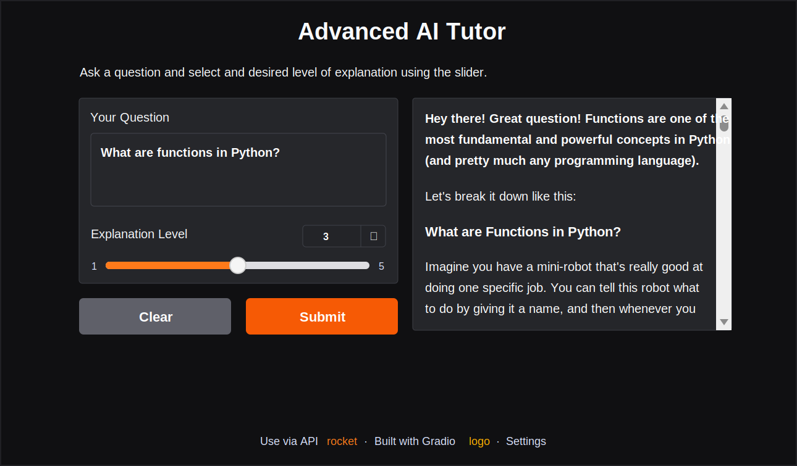

# Day 3 - Adaptive LLM AI Tutor with Gradio

This notebook builds an interactive AI tutor using Gemini and Gradio. It starts with a simple notebook function, then adds a web interface, streaming responses, and a difficulty slider that changes how deeply the tutor explains a topic.



## What This Project Covers

- Loading `GEMINI_API_KEY` from `.env`
- Configuring a Gemini client with `gemini-2.5-flash`
- Creating a reusable AI tutor function
- Displaying responses as Markdown in a notebook
- Building a basic Gradio interface
- Streaming model responses token by token
- Adding an explanation-level slider for adaptive tutoring

## Project Structure

```text
Day3 Adaptive LLMAI Tutor with Gradio/
|-- assets/
|   `-- advanced-ai-tutor-preview.svg
|-- LLMAI-Tutor-with-Gradio.ipynb
|-- requirements.txt
`-- README.md
```

## Requirements

- Python 3.12 or newer
- Jupyter Notebook, JupyterLab, or the VS Code notebook interface
- A Google Gemini API key
- A browser for opening the local Gradio app

## Installation

From the repository root, activate the virtual environment:

```powershell
.\.venv\Scripts\Activate.ps1
```

Install the required packages:

```powershell
pip install -r "Day3 Adaptive LLMAI Tutor with Gradio/requirements.txt"
```

With `uv`:

```powershell
uv pip install --python .\.venv\Scripts\python.exe -r "Day3 Adaptive LLMAI Tutor with Gradio/requirements.txt"
```

## Environment Variables

Create or update the repository-level `.env` file:

```env
GEMINI_API_KEY=your_gemini_api_key_here
```

Do not commit `.env` to GitHub.

## How to Run

1. Open `LLMAI-Tutor-with-Gradio.ipynb`.
2. Select the Python kernel that points to the repository `.venv`.
3. Run the Gemini setup cells first.
4. Run the tutor function cells.
5. Run one of the Gradio interface cells:
   - Simple AI Tutor
   - Streaming AI Tutor
   - Advanced AI Tutor with explanation-level slider

When Gradio starts successfully, it prints a local URL similar to:

```text
http://127.0.0.1:7860
```

Open that URL in a browser to use the tutor.

## Explanation Levels

The advanced interface uses a slider from 1 to 5:

```text
1 - Explain like I am 5 years old
2 - Explain like I am 10 years old
3 - Explain like I am a high school student
4 - Explain like I am a college student
5 - Explain like I am an expert in the field
```

The selected value is inserted into the tutor prompt so the model can adapt its tone, depth, vocabulary, and examples.

## Main Code Flow

```text
User question
  -> Gradio textbox
  -> tutor function
  -> Gemini system prompt + user question
  -> Gemini response
  -> Markdown output or streamed output in Gradio
```

## Public Sharing

For a temporary public Gradio link, change:

```python
ai_tutor_interface_slider.launch()
```

to:

```python
ai_tutor_interface_slider.launch(share=True)
```

Gradio may create temporary local files when `share=True` is enabled. These files do not need to be committed.

## Notes

- The notebook includes a debug print for the generated system prompt. You can remove or comment it out if you want cleaner output.
- The tutor is a learning assistant, not a guaranteed source of truth. Always verify critical technical, medical, legal, or academic claims.
- The notebook currently uses the legacy `google-generativeai` package to match the course code.
